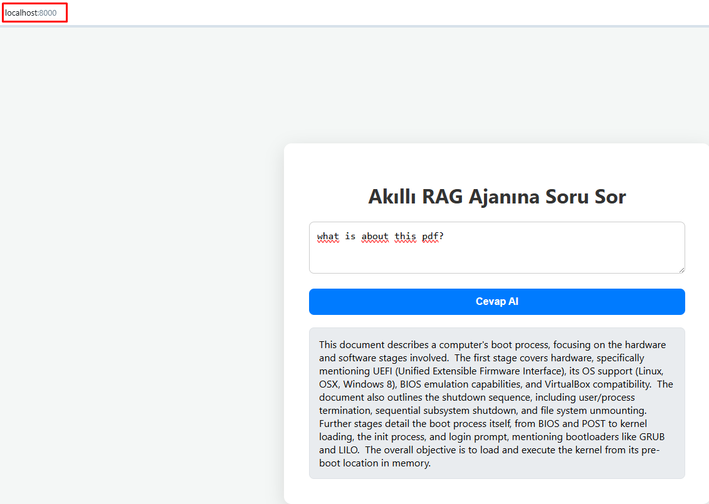

# Akilli-Rag-Ajani

Bu projede gemini kullanılmaktadır. Python sanal makina kurmanız gerekmektedir.
```bash
python -m venv .venv
```


Bu sistem, pdf'deki metinleri vektör embedding'e çevirip Weaviate veritabanına kaydeder. FastAPI üzerinden gelen sorgular da embed edilir, en ilgili belgeler veritabanından alınır. LangChain ve LangGraph ile bu içerikler LLM'e aktarılır ve bağlama dayalı akıllı cevaplar üretilir.

Embedding için gemini kotanız hemen dolabilir. Onun yerine yerelde embedding yapmak isterseniz multi-language olan model = SentenceTransformer("distiluse-base-multilingual-cased-v2") kullanabilirsiniz. 

- Vektör Boyutu: 512 
- Maksimum Token Sınırı: 128 token

Buna rağmen soruları ingilizce sorun çünkü llm türkçe sorulara düzgün cevap veremediğinden bir çok kez tekrar yapıyordu, bende promptu ingilizce yapıp ingilizce olarak sormaya karar verdim ve daha iyi çalışıyor. Eğer Sorunun kalitesini arttırmak isterseniz tekrar sayısını arttırmanız lazım. MAX_ATTEMPTS = 1

## Ortam Değişkenleri (`.env`)
```env
GEMINI_API_KEY=your_api_key
LANGCHAIN_API_KEY=your_key
LANGCHAIN_TRACING_V2=true
LANGCHAIN_PROJECT=SIMPLELLM
WEAVIATE_API_KEY=your_weaviate_key
WEAVIATE_INDEX_NAME=your_index
WEAVIATE_URL=your_url  # main.py içinde yapılandırılır. 
```




